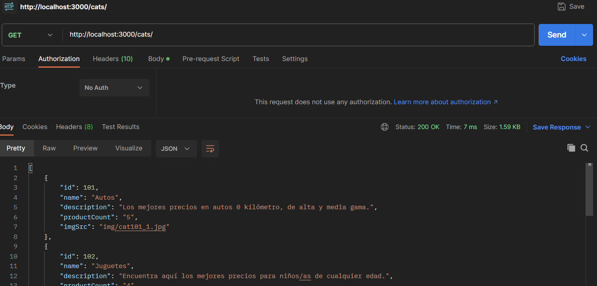
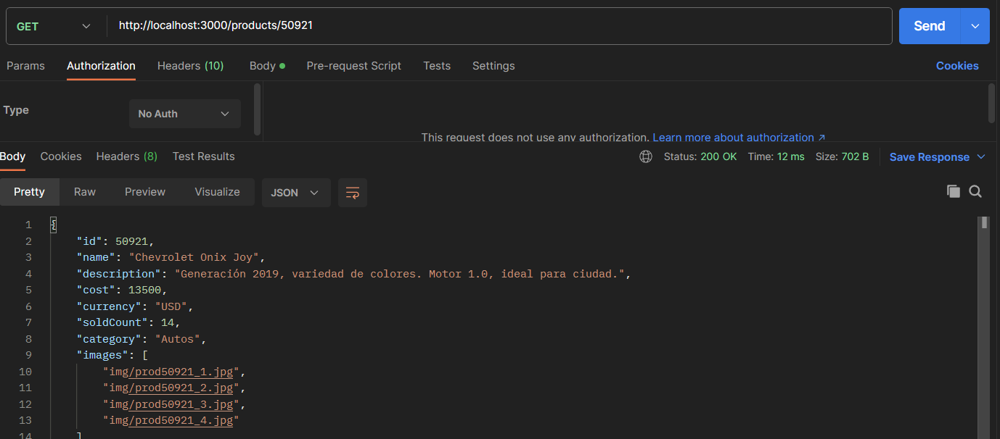
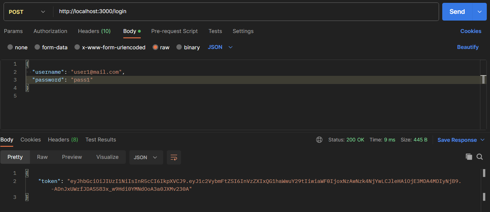
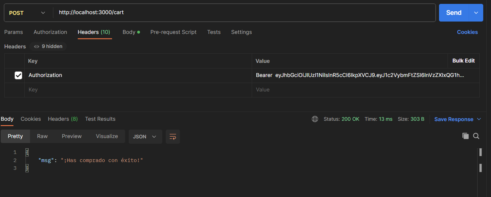
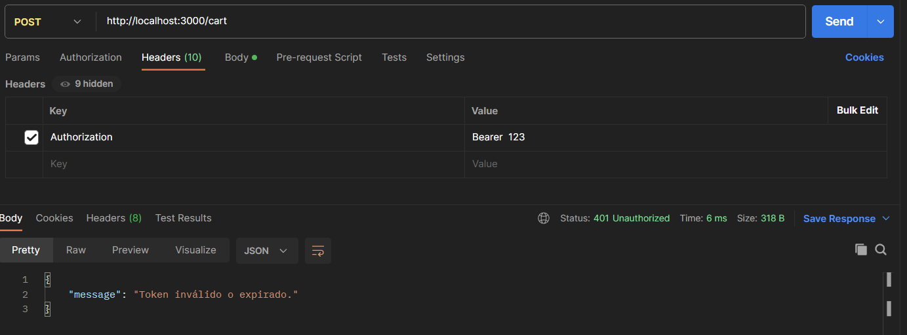
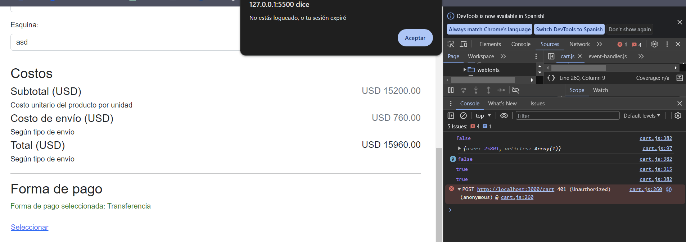

# Proyecto e-commerce
Repositorio dedicado al proyecto de desarrollo web
Instrucciones de Instalación y Ejecución del Proyecto

Este proyecto es un mono repositorio que incluye tanto un backend en Node.js como un frontend en JavaScript. Sigue las instrucciones a continuación para configurar y ejecutar ambos componentes.

## Evidencia de funcionamiento de la api
### Usuarios admitidos por la api en el login (están en la BD):
Con los siguientes usuarios se puede comprobar el funcionamiento de la api para el login, sino no te deja.
-  { username: 'user1@mail.com', password: 'pass1' }
-  { username: 'user2@mail.com', password: 'pass2' }

#### Métodos GET que sustituyen a los que utilizábamos del repo de JAP:

#### Login autorizado:

#### Login con error forzado (usuario no se encuentra en BD):

### Funcionamiento del middleware:

#### Middleware exitoso

#### Middleware con error forzado, token inválido

#### Middleware con error forzado del lado del cliente

## Backend
Para iniciar el servidor backend, ejecuta:

node app.js

Si la configuración es correcta, verás un mensaje indicando que el servidor está corriendo en http://localhost:3000.

#### URLs de Backend
Este proyecto utiliza una serie de URLs específicas para la comunicación entre el backend y el frontend. A continuación se detallan estas URLs, proporcionando una guía clara de cómo se estructura la interacción entre ambos componentes del proyecto.

El backend, desarrollado con Node.js, expone varias rutas API que son consumidas por el frontend. Estas rutas incluyen:

- Categorías: http://localhost:3000/cats/ | *Obtener información sobre diferentes categorías.*
- Publicar Producto: http://localhost:3000/sell/ | *Publicar nuevos productos.*
- Productos por Categoría: http://localhost:3000/cats_products/ | *Obtener productos específicos por categoría.*
- Información del Producto: http://localhost:3000/products/ | *Obtener detalles específicos de un producto.*
- Comentarios del Producto: http://localhost:3000/products_comments/ | *Obtener comentarios asociados a un producto.*
- Información del Carrito de Usuario: http://localhost:3000/user_cart/ | *Obtener la información del carrito de un usuario específico.*
- Compra del Carrito: http://localhost:3000/cart/ | *Procesar la compra de los artículos en el carrito.*